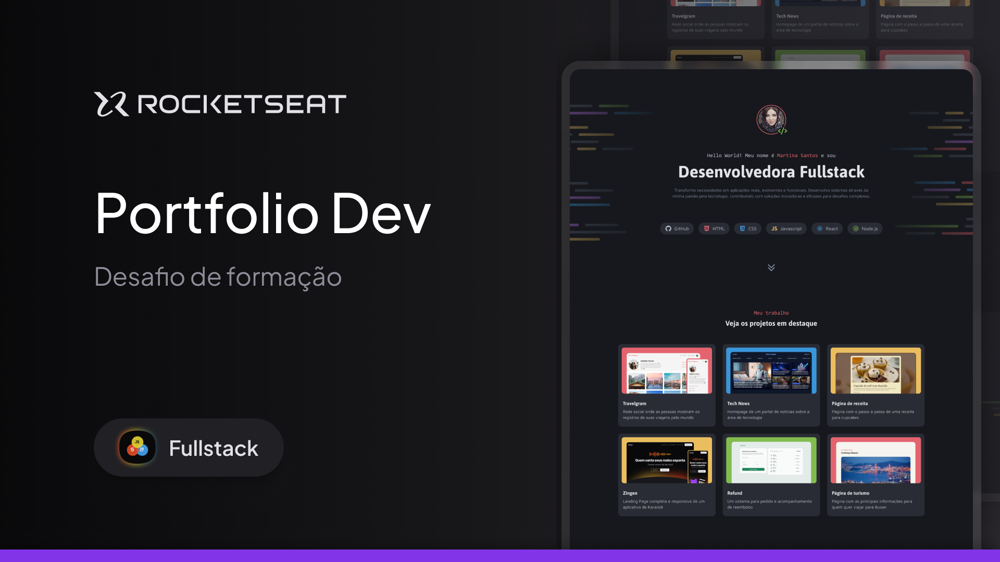
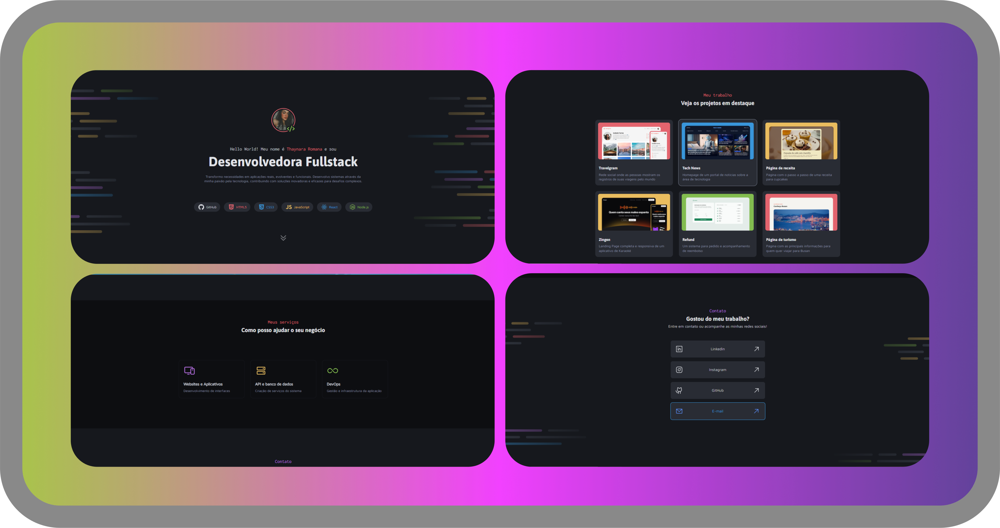
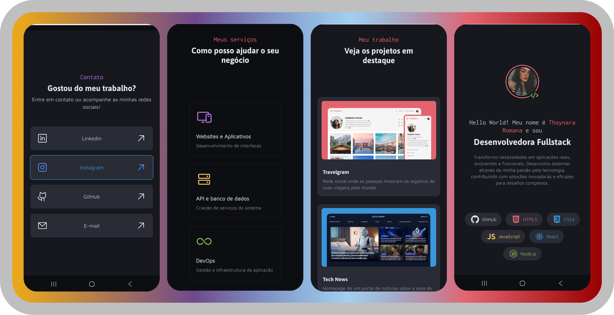

# Documentação do Projeto - Portfólio Dev

## 🌐 Visão Geral

Este projeto foi desenvolvido como parte do **Desafio prático: Portfólio Dev**, proposto pela Rocketseat através da seguinte documentação oficial:

> [https://efficient-sloth-d85.notion.site/Desafio-pr-tico-Portf-lio-Dev-26b4dec88aaa4b5ab86618eb3d78491a](https://efficient-sloth-d85.notion.site/Desafio-pr-tico-Portf-lio-Dev-26b4dec88aaa4b5ab86618eb3d78491a)

O objetivo era **desenvolver um portfólio completo e responsivo**, com base em um layout pré-definido, mas utilizando **somente os conhecimentos aprendidos** ao longo do curso, **sem código pronto ou instruções passo a passo**.

---

## 📋 Considerações Iniciais

- Todo o código foi desenvolvido do zero, sem templates prontos.
- A responsividade foi planejada manualmente, com media queries para tablets e dispositivos móveis.
- Utilizou-se HTML5, CSS3 e boas práticas de estruturação, sem dependências externas de bibliotecas JS ou frameworks CSS.
- Foram aplicados conceitos como:
  - CSS Grid e Flexbox
  - Variáveis CSS (com uso de `:root`)
  - Design mobile-first adaptado
  - Otimização de espaçamento, alinhamento e escalabilidade visual

---

## 🌟 Destaques do Projeto

### Estrutura HTML

O projeto é composto por:

- `<header>`: onde está o perfil, título, saudação e tags de tecnologias.
- `<main>`: dividido em três seções principais:
  - "Meu trabalho": com cards de projetos.
  - "Meus serviços": com ícones e descrição dos serviços oferecidos.
  - "Contato": área com links para redes sociais.

### Estilos CSS

- Separados em módulos: `global.css`, `header.css`, `main.css`, com import centralizado no `index.css`.
- Tipografia responsiva usando `font-size` adaptado por media queries.
- Sistema de cores centralizado via variáveis CSS.
- Layout adaptativo com `max-width`, `gap`, `flex-wrap` e `grid-template-columns` dinâmicos.

### Responsividade

- Media queries para:
  - Tablets (`max-width: 1024px`)
  - Mobile (`max-width: 768px`)
- Ajustes de espaçamento, fontes, grid e largura em cada breakpoint.
- Correções manuais para evitar sobreposições visuais entre `header` e `main`.

---

## 📖 O Que Foi Aprendido

Este desafio foi uma oportunidade de:

- Consolidar a organização de arquivos HTML e CSS.
- Criar um layout responsivo na prática.
- Utilizar CSS Grid e Flexbox com fluidez.
- Gerenciar tipografias e espaçamentos com variáveis CSS.
- Resolver problemas reais de alinhamento, espaçamento e responsividade.
- Entender a importância da semântica e hierarquia visual no HTML.

---

## 🎨 Espaços para Banners

### Banner Inicial



### Banner Final



---

## 📁 Estrutura de Arquivos

```
/
|-- index.html
|-- styles/
|   |-- global.css
|   |-- header.css
|   |-- main.css
|   |-- index.css
|-- assets/
    |-- img/
    |-- icons/
```

---

## 🔧 Como Executar o Projeto

1. Clone o repositório ou baixe os arquivos.
2. Abra o `index.html` diretamente no navegador.
3. Não há necessidade de servidor local ou dependências.

---

## 🚀 Considerações Finais

Este desafio foi uma experiência intensa, feita **com autonomia total** e com a intenção de **testar todos os conhecimentos adquiridos até aqui**. Representa o primeiro passo de muitos na jornada como desenvolvedor front-end.

